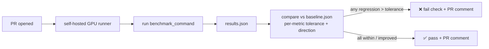

# inference-perf-gate

**A GitHub Action that gates pull requests on GPU-kernel and LLM-serving performance regressions.**

Code-review bots are everywhere. A CI gate that runs your *kernel / inference benchmark*, compares
each metric against a committed baseline, and **fails the PR when throughput drops or latency
regresses** — that is rare. `inference-perf-gate` is that gate, built for the NVIDIA inference stack
(CUDA / Tensor-Core kernels, TensorRT-LLM, vLLM, NCCL).

> Designed to drop straight into reproducible-benchmark repos like
> [`blackwell-tensorcore-kernels`](https://github.com/waynehacking8/blackwell-tensorcore-kernels),
> [`trtllm-triton-serving`](https://github.com/waynehacking8/trtllm-triton-serving), and
> [`nccl-collectives-bench`](https://github.com/waynehacking8/nccl-collectives-bench) — repos that
> already emit committed bench data, which is exactly what this gate diffs against.

## Why this exists

A perf number in a README rots the moment someone refactors a kernel. The only way "106% of cuBLAS"
or "27.7k tok/s" *stays* true is to **re-measure it on every PR and block the merge if it drops.**
That needs three things most CI doesn't give you:

1. **Real GPU hardware** → runs on a **self-hosted runner** (your H100 / Blackwell box), not a
   GitHub-hosted runner.
2. **A committed baseline** → the gate diffs the PR's measured metrics against `baseline.json`,
   per-metric, with a per-metric tolerance (noise floor).
3. **An honest verdict** → higher-is-better (throughput, TFLOP/s, % of cuBLAS) vs.
   lower-is-better (latency, p99) are handled separately; within tolerance = neutral, not a pass.

## How it works



1. Your `benchmark_command` runs the bench and writes a `results.json` (a flat map of
   `metric -> number`, or the schema in [`examples/results.json`](examples/results.json)).
2. The gate loads `baseline.json` (committed) and the metric spec (direction + tolerance).
3. For each metric it computes the delta, classifies **regression / improvement / neutral**, and
   renders a markdown table.
4. It posts/updates a single PR comment and sets the check status. `fail_on_regression: true`
   (default) makes a regression a hard merge block.

## Usage

```yaml
# .github/workflows/perf-gate.yml
name: perf-gate
on: pull_request
jobs:
  bench:
    runs-on: [self-hosted, gpu]      # your H100 / Blackwell runner
    steps:
      - uses: actions/checkout@v4
      - uses: waynehacking8/inference-perf-gate@v1
        with:
          benchmark_command: 'python bench/run.py --json results.json'
          results_path: 'results.json'
          baseline_path: 'bench/baseline.json'
          metrics_path: 'bench/metrics.yml'   # direction + tolerance per metric
          fail_on_regression: 'true'
          github_token: ${{ secrets.GITHUB_TOKEN }}
```

### `metrics.yml` — direction + noise floor per metric

```yaml
# higher_is_better: a DROP beyond tolerance is a regression
# lower_is_better:  a RISE beyond tolerance is a regression
metrics:
  tokens_per_sec:      { direction: higher_is_better, tolerance_pct: 2.0 }
  pct_of_cublas:       { direction: higher_is_better, tolerance_pct: 1.0 }
  decode_p99_ms:       { direction: lower_is_better,  tolerance_pct: 3.0 }
  allreduce_busbw_gbs: { direction: higher_is_better, tolerance_pct: 2.5 }
```

Tolerance is the **measured run-to-run noise** of that metric — set it from a few repeated runs so
the gate fires on real regressions, not jitter. Unlisted metrics are reported but never gate.

## Inputs

| input | required | default | meaning |
|---|---|---|---|
| `benchmark_command` | no | — | command that produces the results file (skip to diff an existing file) |
| `results_path` | yes | `results.json` | the measured metrics the command wrote |
| `baseline_path` | yes | `baseline.json` | committed baseline to diff against |
| `metrics_path` | no | — | per-metric direction + tolerance; defaults to `higher_is_better @ 2%` |
| `fail_on_regression` | no | `true` | hard-fail the check (merge block) on any regression |
| `github_token` | yes | — | to post the PR comment + check |

## Outputs

| output | meaning |
|---|---|
| `regressions_count` | number of metrics that regressed beyond tolerance |
| `report_markdown` | the rendered comparison table |
| `verdict` | `pass` \| `regressed` |

## The honest parts

- **No GPU in public CI.** GitHub-hosted runners have no GPU, so the bundled
  [demo workflow](.github/workflows/demo.yml) runs the *comparator* against committed fixtures on
  CPU — it proves the diff/verdict logic, not a real kernel. The real gate needs your self-hosted
  GPU runner.
- **Tolerance is a claim, not a constant.** A 2% floor is only honest if you measured 2% noise.
  The Action prints the tolerance it used next to each verdict so a reviewer can challenge it.
- **Baseline drift.** Refresh `baseline.json` from a trusted main-branch run when you intend to
  move the bar — but a slow per-PR erosion can hide under tolerance. The report always shows
  delta-vs-baseline *and* absolute values so erosion stays visible.

## License

MIT.
